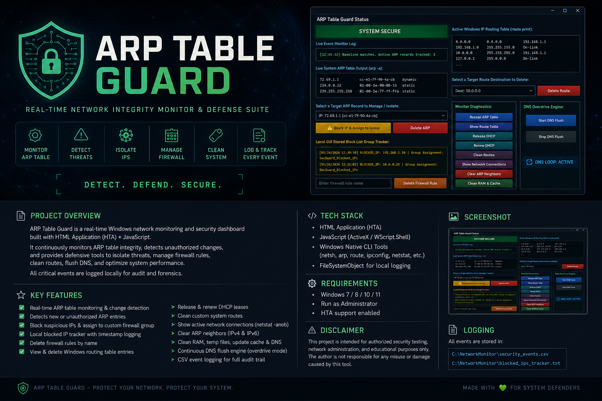

  <a href="https://awakenfury.github.io/BioSignal-Interface/">
    🌐 Live Demo
  </a>

# ARP-TABLE-GUARD
Cyber-Bio Network Security Terminal is an experimental Windows-based security dashboard built as part of the Cyber-Bio research ecosystem.

🛡️ Cyber-Bio Network Security Terminal
Experimental Windows Security Monitoring & Incident Response Console

A defensive cyber-security command console designed to monitor local network activity, visualize system state, and assist with operator-driven incident response.

Overview

Cyber-Bio Network Security Terminal is an experimental Windows-based security dashboard built as part of the Cyber-Bio research ecosystem.

The project combines multiple Windows networking utilities into a unified command console capable of monitoring local network state, detecting changes, logging security events, and presenting the operator with a centralized interface for responding to suspicious activity.

Unlike traditional command-line tools, this project focuses on creating a visual operations terminal inspired by SOC (Security Operations Center) dashboards and futuristic command consoles.

The long-term objective is to integrate this application with the ESP32 Signal Radar project, creating a hybrid cyber-physical sensing platform capable of correlating network activity with environmental sensor data.

Current Features

✅ Live ARP Table Monitoring

Continuous ARP table scanning
Baseline comparison
Highlight known entries
Detect newly discovered devices
Popup alerts for operator awareness

✅ Route Table Viewer

Display Windows routing table
Route selection
Route management interface
Live refresh

✅ Local Firewall Management

Block selected IP addresses
Create inbound/outbound firewall rules
Custom firewall group management
Firewall rule removal

✅ Security Event Logging

CSV event logging
Timestamped activity history
Local tracker database
Blocked IP history

✅ Network Utilities

DHCP Release / Renew
DNS Cache Flush
ARP Cache Refresh
Route Refresh
Connection Viewer

✅ Interactive Security Console

Popup security notifications
Visual status indicators
Security event log
Live network information
Planned Features

The project is still under active development.

Future versions may include:

Network Monitoring
Passive device discovery
MAC vendor lookup
Device fingerprinting
Network topology visualization
Suspicious device scoring
Incident Response
Interactive alert dialogs
One-click isolation
Custom response actions
Quarantine workflow
Response history
Visualization
Cyber-themed dashboard
Live activity timeline
Animated network graph
Threat heat map
Event correlation view
ESP32 Integration

This project is intended to integrate with the ESP32 Signal Radar project.

Possible future capabilities include:

Wi-Fi scanning
BLE scanning
RSSI visualization
Signal strength mapping
Environmental monitoring
Sensor fusion
Cyber-Bio Research

Long-term research includes combining digital network monitoring with physical sensing technologies.

Potential experimental sensors include:

RF monitoring
Environmental sensors
Motion detection
Magnetic field sensing
Acoustic sensing
Signal anomaly detection

The goal is to investigate whether multiple sensing modalities can provide better situational awareness than traditional network monitoring alone.

Design Goals
Defensive security
Operator awareness
Human-in-the-loop response
Lightweight deployment
Offline capable
Local logging
Expandable architecture
Modular components
Project Status

Development Status

🟡 Active Development

Many features are experimental and subject to redesign as the project evolves.

Current priorities include:

improving UI responsiveness,
refining alert workflows,
expanding event logging,
integrating additional monitoring modules, and
preparing for future ESP32 sensor integration.
Roadmap
 ARP monitoring
 Route table viewer
 Firewall management
 CSV logging
 Popup alerts
 DHCP utilities
 Network timeline
 Device reputation scoring
 Signal Radar integration
 ESP32 telemetry
 Environmental sensor fusion
 Cyber-Bio command center
 Multi-node monitoring
 Unified Cyber-Bio dashboard
Vision

This project is one component of the broader Cyber-Bio ecosystem. The long-term vision is to build an integrated defensive platform that combines traditional network telemetry with data from embedded sensor systems. By correlating network events with wireless signal measurements and environmental observations, the platform aims to provide richer situational awareness for research, education, and defensive experimentation.

Disclaimer: This software is intended for defensive security research, system administration, and educational use on systems and networks that you own or are explicitly authorized to manage. It is not intended for unauthorized access, disruption, or offensive security activities.

I think this positioning will fit well alongside your ESP32 Signal Radar, BioWearable Neural Core, and other Cyber-Bio repositories, while clearly communicating that the project is focused on defensive monitoring and research.
